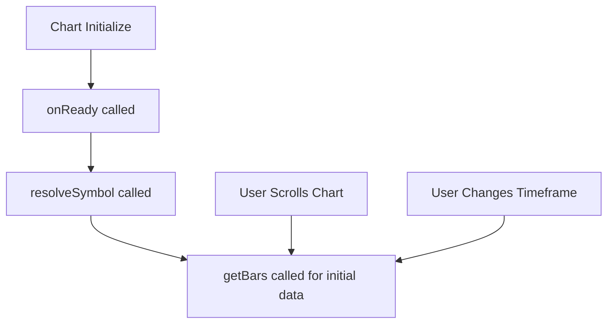

```mermaid
graph TD
    A[Chart Initialize] --> B[onReady called]
    B --> C[resolveSymbol called]
    C --> D[getBars called for initial data]
    E[User Scrolls Chart] --> D
    F[User Changes Timeframe] --> D
```